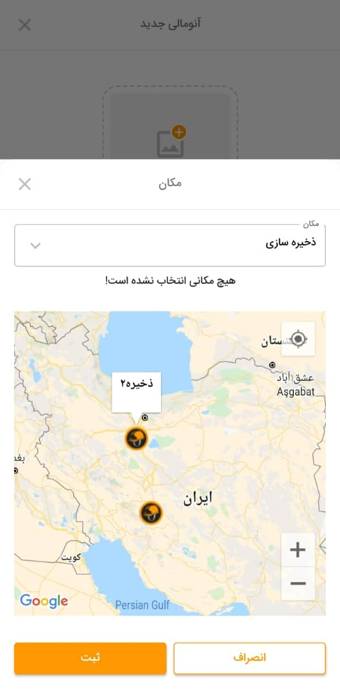
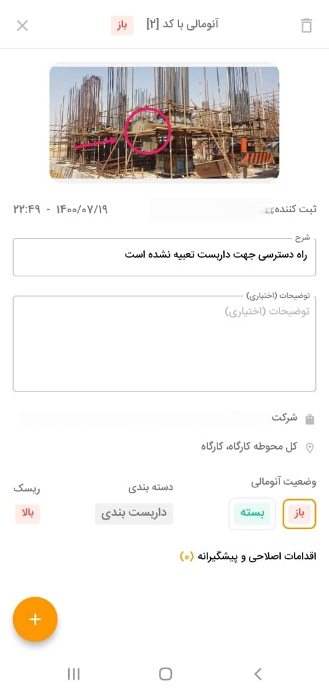

# Plasco

Plasco is a mobile application designed to streamline **Health, Safety, and Environment (HSE)** processes for organizations. It empowers users with a comprehensive suite of features to enhance safety reporting, communication, and collaboration.

## **Key Features**

- **Anomaly Reporting:** Easily submit detailed reports of safety incidents, hazards, and near misses, including photos and videos.
- **File Sharing:** Securely send and receive essential HSE-related documents for efficient collaboration and record-keeping.
- **Contact Management:** Add and manage profiles of key personnel involved in HSE activities, facilitating quick communication.
- **... (Add more features here)**

## **Getting Started**

### **Prerequisites:**

- Flutter development environment set up ([Flutter Installation Guide](https://flutter.dev/docs/get-started/install))
- A code editor or IDE of your choice (e.g., Visual Studio Code, Android Studio)

### **Installation:**

1. Clone the Plasco repository:

   ```bash
   git clone [repository_url]
   ```

2. Navigate to the project directory:

   ```bash
   cd Plasco
   ```

3. Install dependencies:

   ```bash
   flutter pub get
   ```

4. Connect your device or launch an emulator.

5. Run the app:

   ```bash
   flutter run
   ```

## **Screenshots**

# Plasco App Screenshots

Here are some screenshots of the Plasco app for better visualization:

| Screenshot 1       | Screenshot 2       | Screenshot 3       |
|--------------------|--------------------|--------------------|
|  |  |  |

| Screenshot 4       | Screenshot 5       |
|--------------------|--------------------|
|  |  |


## **Compatibility**

This app is currently compatible with Flutter versions `<2.12.0` (Dart SDK `<2.12.0`) as it does not support null safety.

## **Contributing**

We welcome contributions from the community! 

---

**Version:** 1.1.0+1  
**Environment SDK:** `<2.12.0`
